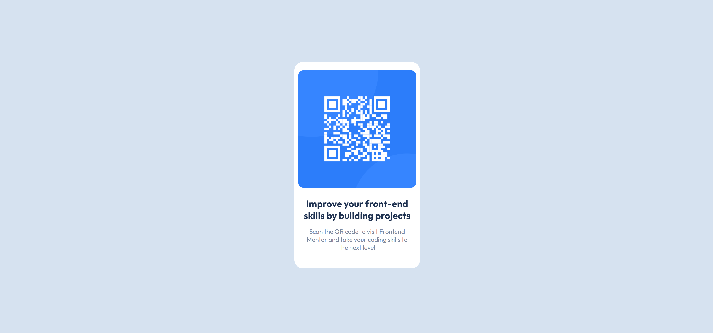

# Frontend Mentor - QR code component solution

This is a solution to the [QR code component challenge on Frontend Mentor](https://www.frontendmentor.io/challenges/qr-code-component-iux_sIO_H/hub/qr-code-component-3GuDK7VAdv).

## Table of contents

- [Overview](#overview)
  - [The challenge](#the-challenge)
  - [Screenshot](#screenshot)
  - [Links](#links)
- [My process](#my-process)
  - [Built with](#built-with)
- [Author](#author)

### Screenshot

### Links

- Live Site URL: [Live Site at Vercel](https://majid-rm.github.io/QR-code-component/)

## My process

### Built with

- Semantic HTML5 markup.
- Flexbox.
- Responsive Design.

## Author

- Github - [Majid-RM](https://github.com/Majid-RM)
- Frontend Mentor - [@Majid-RM](https://www.frontendmentor.io/profile/Majid-RM)
